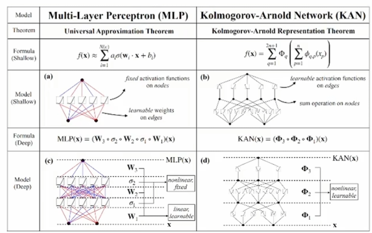
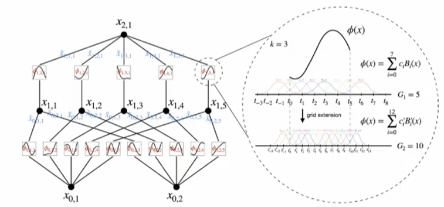
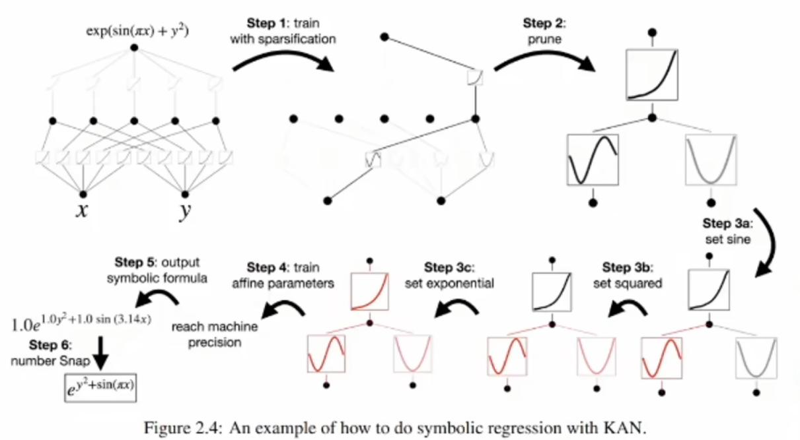
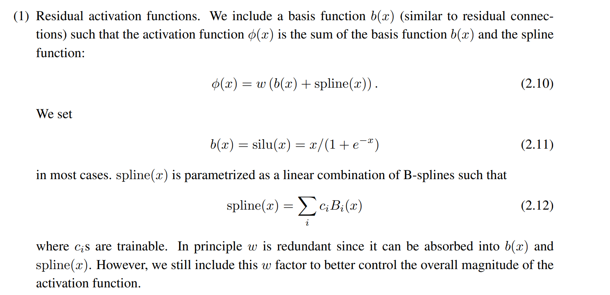

# KAN 

 ### 提出背景 
1. mlp为基础的架构下,使用多级层一次线性函数,有梯度消失,梯度爆炸问题,即使后人提出dropout,L1等方法来应对上述问题,但是并不能彻底解决.
2. mlp为基础的网络需要大量的参数来使得网络足够智能,导致在一些任务下,模型参数量巨大.如GPT等模型有千亿以上的参数,其中核心的参数远远小于总量. 
3. 多层mlp+激活函数 来拟合非线性函数, 但是其过程中的一些线性函数也需要一次函数来拟合.何不直接使用一次函数来拟合非线性函数? 

 
(KAN网络的最大特征就是用样条曲线函数直接拟合线性函数) 

1. 用正弦函数来拟合任意线性函数.
 

 

2. 用剪枝来简化网络结构 

## 细节 
1. 激活函数,偏置项 

## 缺陷 
1. 计算比较复杂,gpu计算效率不高 
2. 

## 总结 
