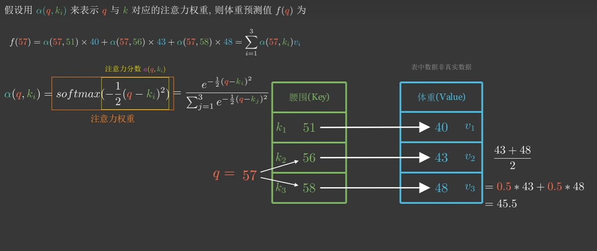
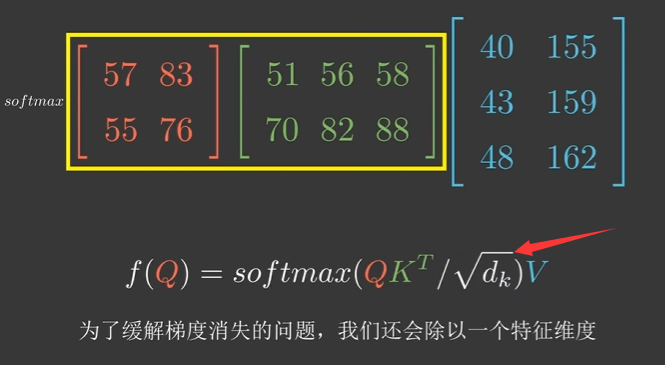
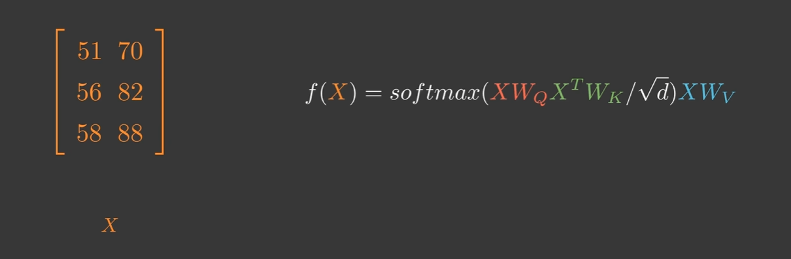
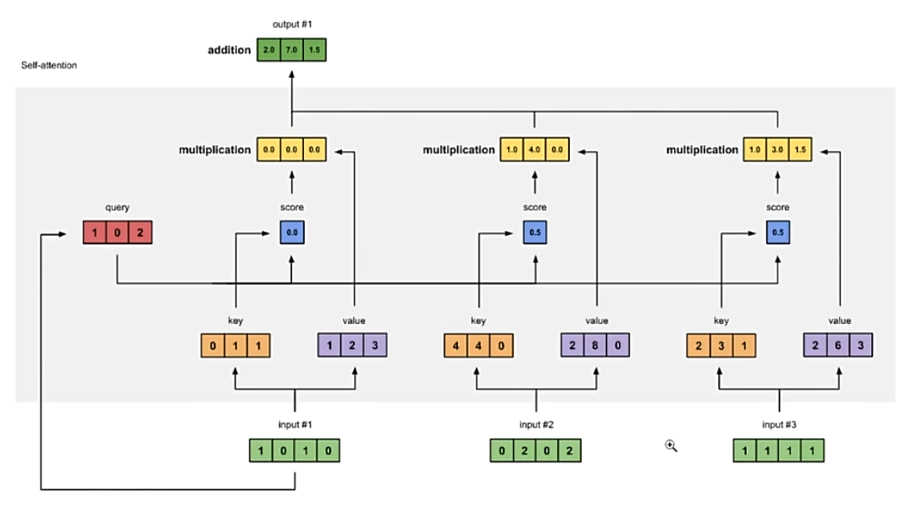
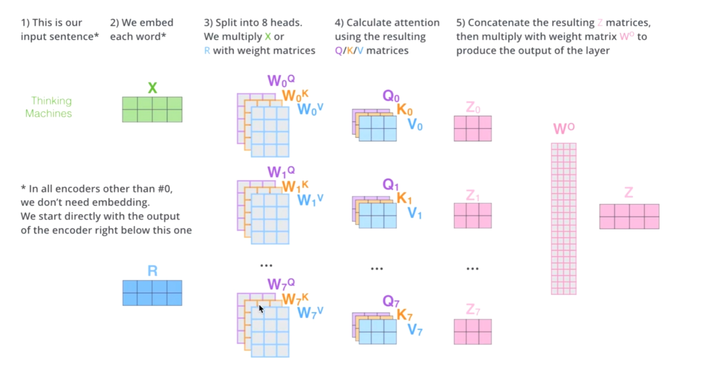

# 注意力机制
*捕捉Q,K之间的关系,来得出结果*

## 1.对于一维QKV 
 

#### **输入Q,与Ki的点积得到那些Vi需要注意,需要多少的注意(权重),把各个vi*权重a(Q,K)得到结果**

**f(q)**,计算**Q**对全局**K**的关联程度,即`a(Q,K)`,获得**Q**对于全局键值对 **(Q,k)**因为``softmax()``所以置信度为(0~1)之间.

### 2. 高维QKV 
 

### 3.自注意机制的QKV 
普通的点积QKV,其中的KV是给定的,没什么可以训练的地方. 
提出自注意力机制  

*只关心输入X中元素的内在联系;*
1. 通过训练(可以是全连接等方法),训练出X对应的WQ,Wk,Wv(注意,这里的三个参数都是根据X自己得出的,如果X为高维(多组输入组成的矩阵),那么每组输入有对应自己的WQ,WK,Wv),来确定自己内部元素之间的关联度,并乘以对应KEy的值,得出答案.

下图为
根据#1得出的Q,计算#1与全局的关联度的方法.即计算根据#1计算出的Q,点积#1,#2,#3经过学习得到的K(即计算与这三者的关联度),再乘对应key的Value,得到output,即#1对于#1,#2,#3的注意力得分.  值得注意的是,对Q1*Ki的点积的softmax(),可以让中注意力权重之和为1.  

<u>**本质上,是根据#1得出的Q,逐个与序列中的其他项的Ki,vi做QKV方程计算,最终得到#1与整个序列的关联度表output**</u>
 

### 2.多头注意力机制  
普通自注意力机制的升级版 

在标准的自注意力机制中,对于序列中任意两个单词对,我们计算它们之间的相似性得分,作为注意力权重。**但这种方式对于所有单词对都使用了相同的注意力计算方式,无法针对不同的位置关系(如近邻、远距离、前后关系等)施加不同的注意力模式。** 

而在多头注意力中,我们首先将输入通过不同的线性变换映射到不同的子空间表示,相当于为每个"头"生成一个子表示:
`head_i = W_i * X      (i=1...h,  h为头数)` 

其中不同的W_i对应不同的线性变换,会产生不同的子空间表示head_i。
然后在每个head_i上分别计算自注意力,得到不同的注意力分布:
`Copy codeattention_i = SelfAttention(head_i)` 

由于不同头对应不同的子空间表示,在计算注意力时就会自动关注不同的位置和语义信息。比如某一头可能更关注局部位置关系,另一头则偏向全局依赖等。 

最后,将所有头的注意力表示合并得到最终输出:
`Copy codeMultiHead(X) = Concat(attention_1, ..., attention_h) * W_o` 

其中 W_o 是一个可训练的权重矩阵,用于合并多头信息。

 
把原始输入X投影到size(x)/h 的维度上,在低维的X'上列QKV矩阵,得到Zi.最后把Zi用Wo权重的方式合并.  

**本质: 给h次机会,让各个头的Wqi,wki,Wvi以不同的随机种子发芽,来希望模型能匹配到不同的模式(类似卷积网络的不同卷积通道)**

**ps:把x切h是受到cnn的启发,实际上的实验证明了,减少每个头输入的维度,对于整体的效果也不错.**