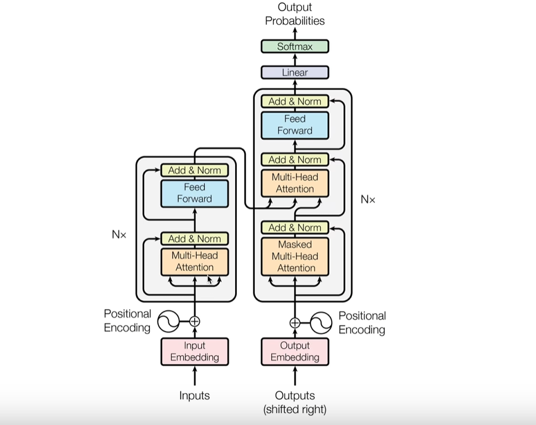
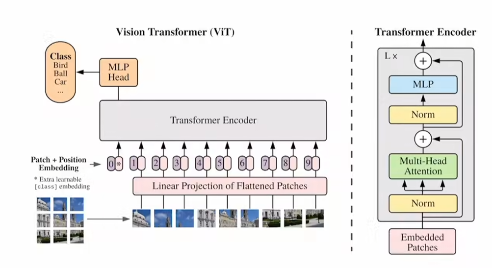
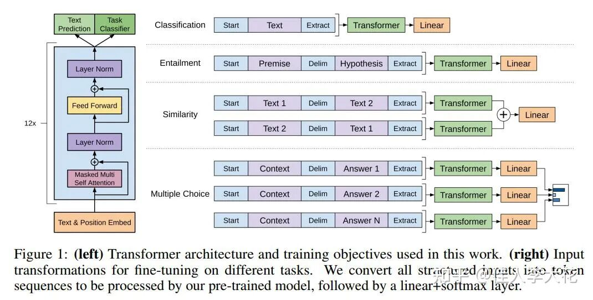

## transformer  

概述:使用注意力机制的模型架构  
 
 
1. *使用encoder_decoder的transformer结构*  
 

**适用于语言翻译等要求输入输出严格对应的任务** 

 
 
2. 只是用encoder的结构 (以vit为例)

  
**无需考虑以前时刻的输出,一次输入输出,即为一次生成的全过程**  

 
 
3.只用decoder的结构 (decoder only) 

 
**只需在以前的输出上不断接龙 **
