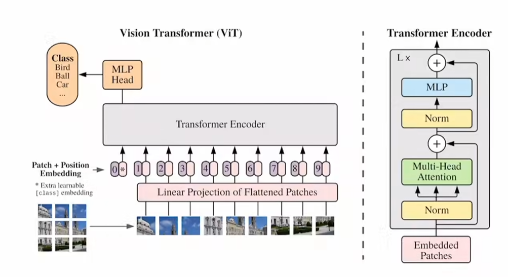
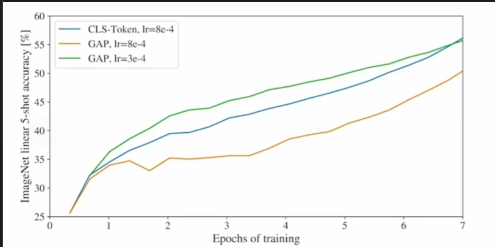

# Vision Transformer 

[😶‍🌫️Video](https://www.bilibili.com/video/BV15P4y137jb)

  
## 解决问题 
 1.传统trans解决nlp问题,序列长度较短,但应用于视觉领域,若用像素作为输入元素,序列长度会过长 

## 步骤 
1. 将图片切成较小维度的path 
2. 用线性投射层成将图片信息变为向量 (更符合原生transformer的操作),将视觉问题适配用于解决nlp问题的transformer模型 (图片维度从 x$*$ y $*$ 3 ==>> patch数量个 (patchx$*$patchy$*$特征数) 的token了)
3. 加入位置编码,分类属性(类似nlp问题中输入trans前在encoder前给文本向量添加属性的方式),把path转换为token
4. 使用encoder模块 
5. 连接一个全连接层,将分类结果输出 

  

## Q&A 

**Q1:** 所有的embedding都在encoder里面做Qkv计算,在所有的输出中,把谁的输出当作模型输出结果? 
**A1:** 借鉴bert,引入`[cls]` embbding,希望'[cls]'能在注意力计算中能从别的embemdding学习到有用的信息,用全连接层对class embeding分类,得出模型输出.

  

**Q2:** 位置编码是如何加入的?patch是如何变为类似nlp的token的? 
**A2:** 假设原图尺寸( 224$*$224$*$3 ),patchSize取(16 $*$ 16),则生成196个 (16 $*$ 16 $*$3) 的一维向量 ,再通过(768 * 768)的线性投影层. 输出为patch embedding
 
  

**Q3:** 如何在patchEmbedding 里加入位置编码的? 
**A3:** 假设还是(196 * 768),直接构建一个可学习的矩阵(196 * 768) ,直接与patchEmbed相加,在初始时候初始化随机. 

  

**Q4:** [cls] token的方法是直接从nlp借鉴过来的,能用cv一般用的全局平均池化吗?
**A4:** 在实验中,两者性能相似 
